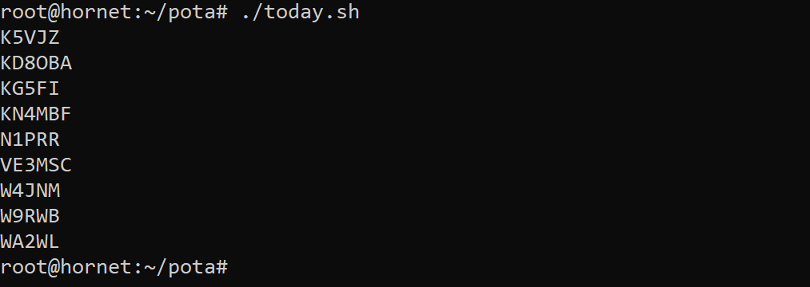

# FT8-WSJTX-scripts

### cqpota.sh

Keep a running list of CQ POTA callers

### today.sh

List stations contacted today

### hunt.sh

Look for a station (to verify you're receiving them). Note: This could be filtered to the current date.

Usage: ./hunt.sh K0BUF

